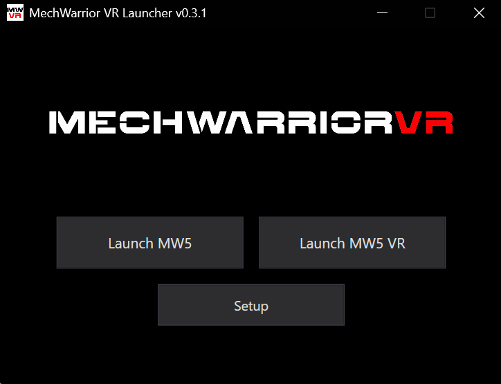
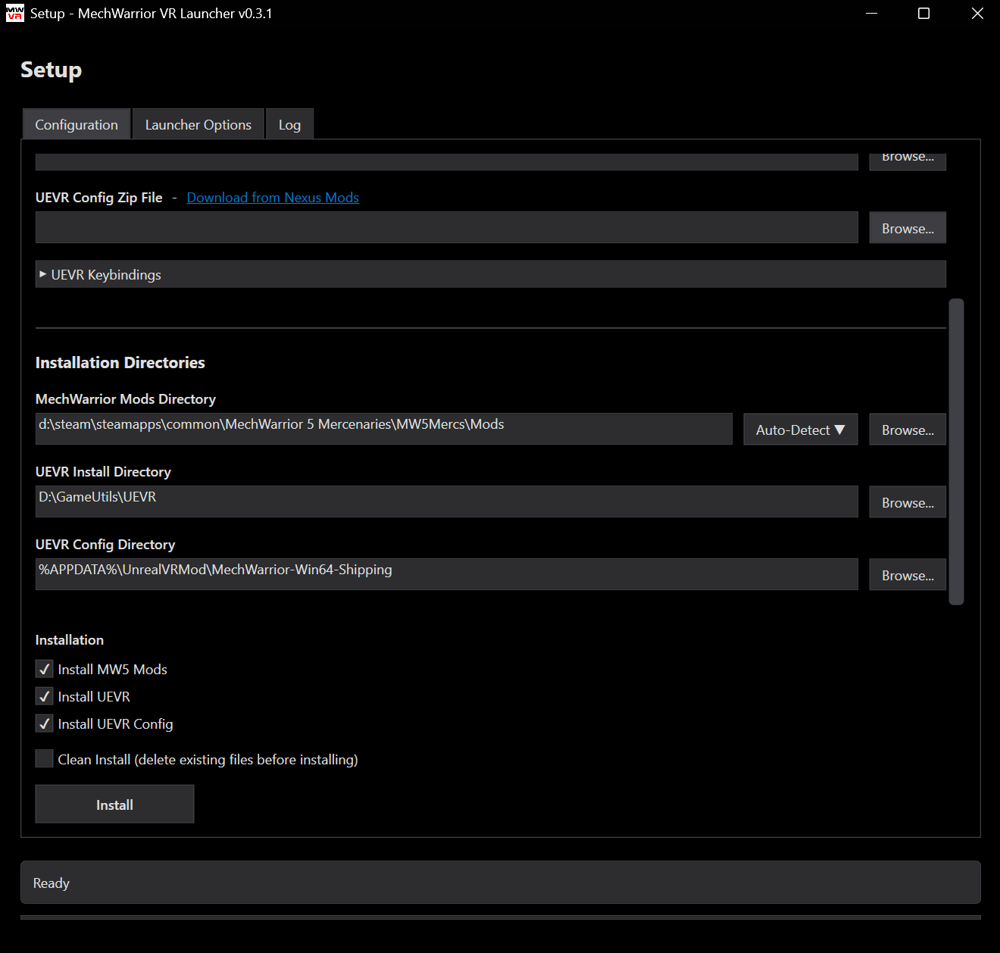
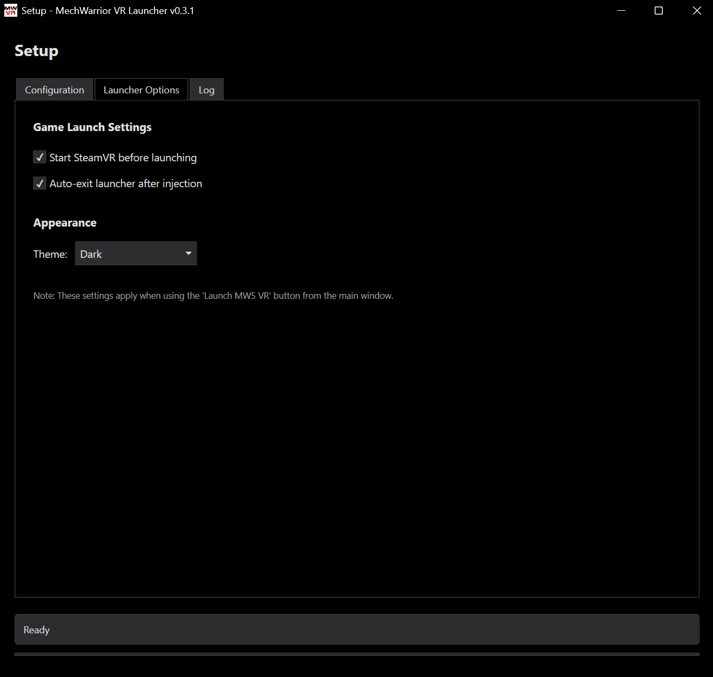

# MechWarrior VR Launcher

A launcher and setup application for MechWarrior 5: Mercenaries VR that simplifies UEVR injection and mod management.

## Screenshots

## Features

- Provides links to mod and dependency files and installs them to locations specified by the user
- Two-button launch system: Launch MW5 (flat) or Launch MW5 VR (with VR injection). Non-VR launch auto disables the VR mods in the MW5 modlist.json
- Automatic UEVR DLL injection
- Steam and GOG (untested) platform support
- Customizable UEVR keybindings
- Dark and light theme support
- SteamVR auto-start option

## Command line parameters

`--launch-inject` or `/launch-inject` can be used to automatically launch MW5 in VR mode. The launch options in the setup screen can be used to modify the behavior

## Attribution

This project includes code adapted from:

- **Custom-UEVR-Injector** by mirudo2 - DLL injection implementation
  https://github.com/mirudo2/Custom-UEVR-Injector
